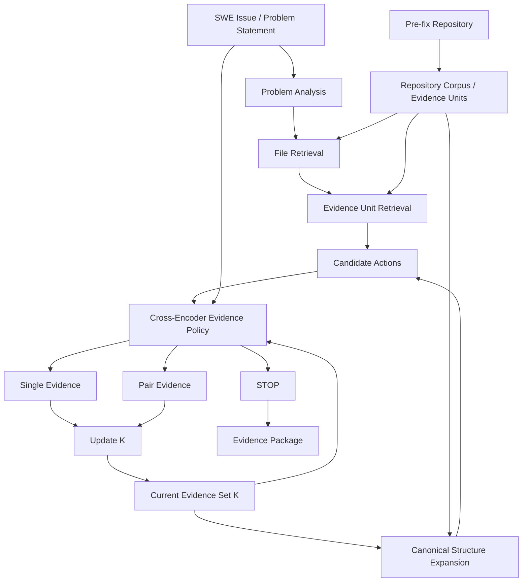

# Evidence Agent

> **Gather, Combine, or Skip：面向软件修复的证据交互感知 RAG、Evidence Policy 与多智能体上下文获取系统**

Evidence Agent 是一个面向软件工程问题定位与修复上下文获取的研究项目。项目以 **SWE-bench 问题描述 + 修复前（pre-fix）代码仓库** 为输入，通过多通道 RAG、状态感知的仓库结构扩展、统一的 Evidence Policy 模型以及多智能体协同机制，迭代选择最有价值的代码证据，并在达到预定义的修复上下文充分性标准后停止。

本项目当前的核心目标不是直接生成补丁，而是构建一个可靠的 **Evidence Acquisition / Context Acquisition System**，为下游代码修复模型提供可定位、可组合、可解释、可追踪的结构化 Evidence Package。

---

## 目录

- [1. 项目目标](#1-项目目标)
- [2. 项目定位与非目标](#2-项目定位与非目标)
- [3. 系统总体架构](#3-系统总体架构)
- [4. 核心研究问题](#4-核心研究问题)
- [5. 核心模块](#5-核心模块)
- [6. RAG 与 Retriever](#6-rag-与-retriever)
- [7. Canonical Structure Retrieval](#7-canonical-structure-retrieval)
- [8. Evidence Policy 模型](#8-evidence-policy-模型)
- [9. 多智能体协同](#9-多智能体协同)
- [10. Unified SWE Dataset V2.10](#10-unified-swe-dataset-v210)
- [11. 数据 Schema](#11-数据-schema)
- [12. 监督体系](#12-监督体系)
- [13. 数据泄漏与安全边界](#13-数据泄漏与安全边界)
- [14. 当前已验证结果](#14-当前已验证结果)
- [15. 项目目录建议](#15-项目目录建议)
- [16. 环境与依赖](#16-环境与依赖)
- [17. 数据构建与发布](#17-数据构建与发布)
- [18. 审计与质量门禁](#18-审计与质量门禁)
- [19. 模型训练阶段](#19-模型训练阶段)
- [20. Agent Online Rollout](#20-agent-online-rollout)
- [21. 评估体系](#21-评估体系)
- [22. 实验与消融](#22-实验与消融)
- [23. 当前开发状态](#23-当前开发状态)
- [24. 下一阶段路线图](#24-下一阶段路线图)
- [25. 版本与复现](#25-版本与复现)
- [26. 数据来源与许可证](#26-数据来源与许可证)
- [27. FAQ](#27-faq)
- [28. 项目事实来源](#28-项目事实来源)

---

# 1. 项目目标

本项目研究：

> **在有限预算下，软件修复 Agent 应该读取哪些仓库证据、哪些证据需要组合、哪些证据可以相互替代，以及何时停止继续探索。**

输入为：

```text
SWE Issue / Problem Statement
+
Pre-fix Repository Snapshot
```

系统经过多轮证据获取后输出：

```text
Evidence Package
├── Selected Files
├── Selected Evidence Units
├── Relevant Symbols
├── Structural Relations
├── Acquisition Trace
└── Sufficiency / STOP Decision
```

Evidence Package 的目标是支持下游修复模型完成：

- Bug localization；
- Root-cause analysis；
- Dependency / state-flow analysis；
- Behavior constraint understanding；
- Patch planning。

更准确地说，本项目希望实现：

> **达到预定义修复上下文充分性标准，并为下游修复模型提供可靠的定位、原因分析与补丁规划上下文。**

项目不声称仅凭 Evidence Agent 就能保证最终代码修复成功。

---

# 2. 项目定位与非目标

## 2.1 当前项目定位

Evidence Agent 是一个融合以下三条技术路线的系统：

1. **RAG / Repository Retrieval**
2. **Evidence Policy Model Training**
3. **Multi-Agent / Agentic Evidence Acquisition**

三者的职责不同：

| 模块 | 核心问题 |
|---|---|
| RAG | “有哪些证据值得看？” |
| Evidence Policy | “当前最应该选择哪个证据、哪组证据，还是 STOP？” |
| Multi-Agent | “如何组织多轮检索、结构探索、决策和停止？” |

---

## 2.2 当前非目标

当前 Evidence Agent **不负责**：

- 生成代码补丁；
- 自动修改仓库；
- 运行测试；
- 根据测试反馈继续修复；
- 用修复后代码作为在线输入；
- 保证下游修复一定成功。

因此当前系统边界为：

```text
Issue + Pre-fix Repository
          ↓
Evidence Acquisition
          ↓
Structured Evidence Package
          ↓
Downstream Repair Model
```

而不是：

```text
Issue
 ↓
直接自动生成最终 Patch
```

---

# 3. 系统总体架构



在线执行过程可以写成：

```text
q = issue
K = ∅

while True:
    candidates = Retriever(q, K, pre_fix_repo)
    A* = argmax_A Policy(q, K, A)

    if A* == STOP:
        break

    K = K ∪ Evidence(A*)

return EvidencePackage(K)
```

---

# 4. 核心研究问题

项目的研究重点不是普通的静态 `query → document relevance`，而是：

> **Given what I already know, what should I acquire next?**

设：

- `q`：软件问题描述；
- `K`：当前已经获取的证据集合；
- `A`：候选动作。

统一策略模型为：

\[
s_A = f_\theta(q, K, A)
\]

候选动作包含：

```text
[u]       单 Evidence
[u, v]    双 Evidence
STOP      停止证据获取
```

因此系统需要同时学习：

- Evidence relevance；
- Evidence incremental value；
- Evidence complementarity；
- Evidence substitutability；
- Evidence redundancy；
- STOP / context sufficiency。

---

## 4.1 Value-of-Information 研究视角

项目理论主线可以进一步解释为 Evidence Value-of-Information。

定义当前证据包对下游修复过程的价值：

\[
V_G(K)
\]

候选证据 `u` 的条件边际价值：

\[
\Delta_G(u \mid K)
=
V_G(K \cup \{u\}) - V_G(K)
\]

考虑读取成本后：

\[
Q_G(u \mid K)
=
\Delta_G(u \mid K) - \lambda Cost(u)
\]

两条证据之间的交互价值可写为：

\[
I_G(u,v\mid K)
=
V_G(K\cup\{u,v\})
-
V_G(K\cup\{u\})
-
V_G(K\cup\{v\})
+
V_G(K)
\]

这一视角用于解释：

```text
complement
substitute
redundant
independent
conflict
```

需要注意：

> **当前 V2.10 已实现的数据与 Policy supervision 主要基于 deterministic supervision、aligned public context、obligation / witness 和 verified teacher labels。完整的 behavior-calibrated `V_G` 实验属于后续研究扩展，不应把尚未实现的行为校准写成当前已经完成的功能。**

---

# 5. 核心模块

整个项目可以拆成七个主要模块。

```text
1. Repository Corpus / Evidence Unit
2. RAG / Retriever
3. Canonical Structure Retrieval
4. Supervision / Dataset Builder
5. Evidence Policy Model
6. Multi-Agent Orchestration
7. Evaluation / Audit
```

---

## 5.1 Repository Corpus / Evidence Unit

该模块将完整代码仓库转换成可检索、可排序、可引用的 Evidence Space。

基本层级：

```text
Repository
└── File Version
    └── Evidence Units
        ├── class
        ├── function / method
        ├── code block
        ├── branch / local region
        └── other scoreable units
```

一个 Evidence Unit 至少包含：

```text
evidence_id
file_version_id
path
unit_type
symbol
start_line
end_line
content
parent_evidence_id
rendered_token_count
```

Evidence Unit 的作用是避免把完整文件直接塞入 Cross-Encoder，使模型可以在细粒度代码证据上进行动作决策。

---

## 5.2 Supervision / Dataset Builder

原始 SWE 数据并不会直接给出：

```text
step 0 -> Evidence A
step 1 -> Evidence B
step 2 -> STOP
```

因此数据构建器需要把：

```text
SWE-bench patch / test patch
ContextBench aligned context
SWE-Explore aligned evidence
deterministic rules
verified teacher labels
```

转换成：

```text
obligations
witness groups
evidence labels
policy states
candidate actions
STOP labels
loss masks
```

最终形成可训练的序列决策状态。

---

# 6. RAG 与 Retriever

RAG 层的职责不是最终决定“哪个 Evidence 一定正确”，而是提高：

> **Candidate Reachability**

也就是让真正有价值的 Evidence 尽可能进入 Policy Model 的候选池。

---

## 6.1 File Retrieval

V2.10 使用两个文件召回通道：

```text
problem q
├── path_name_file
└── content_fts_file
```

冻结参数：

| 参数 | V2.10 |
|---|---:|
| Path file cap | 32 |
| Content FTS file cap | 64 |
| Online file union cap | 96 |

Path Retrieval 适合：

```text
foo.py
CacheManager
parser
serializer
```

Content FTS 适合：

```text
refresh stale cache
incorrectly handles timeout
unexpected exception
wrong output under condition X
```

两个通道做 union 后再进入 Evidence Unit 层。

---

## 6.2 Evidence Unit Retrieval

当前 Evidence Unit 级通道：

```text
bm25_content
path_name
symbol
structure
```

冻结参数：

| 参数 | V2.10 |
|---|---:|
| Online unit universe cap | 4096 |
| Channel depth | 64 |
| Final depth | 64 |
| RRF k | 64 |
| Channel head reserve | 8 |
| Regular pair cap | 8 |

融合方式：

```text
channel-head-preserved RRF
```

Retriever 版本：

```text
retriever-v2.10-stream-fts-clean-canonical-1hop-head-rrf
```

---

## 6.3 为什么不只使用 Cross-Encoder

Cross-Encoder 只能对“已经进入候选池”的动作评分。

如果正确 Evidence 根本没有被 Retriever 找到：

```text
correct Evidence ∉ candidate set
```

那么再强的 Cross-Encoder 也无法选择它。

因此系统分成两个不同问题：

```text
Retriever:
正确证据是否可达？

Policy:
候选可达后，当前应该选择哪个？
```

---

# 7. Canonical Structure Retrieval

Structure Retrieval 是本项目从普通静态 RAG 走向 Agentic RAG 的关键。

普通 RAG：

```text
q
↓
Retriever
↓
Documents
```

本项目还允许：

```text
Current Evidence K
        ↓
Canonical Pre-fix Repository Structure
        ↓
parent / child / previous / next
        ↓
New Evidence
```

即：

\[
R_{\text{structure}}(K, \mathcal{G}_{repo})
\]

---

## 7.1 V2.10 的 canonical structure 约束

V2.10 明确要求：

```text
Current K
+
Pre-fix Repository
```

是 structure expansion 唯一允许的信息来源。

禁止：

```text
offline witness
gold patch
test patch
gold context marker
teacher answer
```

参与 online graph。

---

## 7.2 真实 adjacency

假设完整文件中的 Evidence Unit 顺序为：

```text
A - B - C - D - E
```

即使当前 lexical candidate subset 只有：

```text
A, E
```

也绝不能构造：

```text
A <-> E
```

V2.10 的 adjacency 基于完整 `file_version` 中真实 scoreable Evidence Unit 的顺序。

---

## 7.3 1-hop Expansion

当前默认使用 canonical 1-hop：

```text
K Evidence
├── parent
├── child
├── previous scoreable unit
└── next scoreable unit
```

结构扩张允许将 lexical 4096 base universe 之外的真实邻居加入当前 state-visible candidates。

这意味着：

```text
q-only lexical retrieval
        ↓
base online universe
        +
current K
        ↓
canonical 1-hop
        ↓
state-visible universe
```

而不是要求结构邻居先被 lexical Retriever 找到。

---

# 8. Evidence Policy 模型

项目最终只训练 **一个** Evidence Policy 模型。

核心函数：

\[
s_A = f_\theta(q,K,A)
\]

其中：

```text
q = problem statement / issue
K = current evidence set
A = [u] | [u,v] | STOP
```

---

## 8.1 统一动作空间

同一个 Cross-Encoder 同时评分：

```text
score(q, K, [u])
score(q, K, [u, v])
score(q, K, STOP)
```

运行时执行：

```text
A* = argmax_A score(q, K, A)
```

如果：

```text
A* = [u]
```

则：

```text
K := K ∪ {u}
```

如果：

```text
A* = [u, v]
```

则：

```text
K := K ∪ {u, v}
```

如果：

```text
A* = STOP
```

则结束 Evidence Acquisition。

---

## 8.2 一个模型，不是多个模型

“只训练一个模型”意味着：

- Single、Pair、STOP 共用 Backbone；
- 共用统一动作排序头；
- 不训练独立 STOP classifier；
- 不训练独立 Pair selector；
- Retriever 是 deterministic / non-trainable；
- Teacher 只参与离线 supervision；
- 多智能体中的不同 Agent 角色不等于多个训练模型。

---

## 8.3 Backbone

当前项目 **尚未固定最终 Policy Backbone**。

推荐实现时使用可配置接口，例如：

```python
AutoTokenizer
AutoModelForSequenceClassification
```

或自定义 Cross-Encoder ranking head。

V2.10 manifest 中记录的：

```text
BAAI/bge-reranker-v2-m3
revision:
953dc6f6f85a1b2dbfca4c34a2796e7dde08d41e
```

当前主要是 **冻结的 tokenizer / token accounting contract**。

它不应被 README 或论文误写为“最终 Policy Backbone 已经确定为 bge-reranker-v2-m3”。

---

## 8.4 输入长度契约

冻结参数：

```text
model_max_length = 4096
question_max_tokens = 2048
```

候选 Evidence Unit 正文不能被 DataLoader 静默截断。

如果完整：

```text
(q, K, A)
```

仍超过 4096：

```text
scoreable = false
action_loss_mask = false
```

该动作保留用于审计，但不进入训练 loss。

---

# 9. 多智能体协同

多智能体层的目的不是让多个大模型重复聊天，而是把不同 Evidence Acquisition 职责解耦。

目标架构可以划分为：

```text
Problem Analysis Agent
        ↓
Retrieval Agent
        ↓
Structure Exploration Agent
        ↓
Evidence Policy Agent
        ↓
Sufficiency / Coordinator Agent
```

---

## 9.1 Problem Analysis Agent

负责从 Issue 中抽取：

- Error behavior；
- Related subsystem；
- Potential files；
- Symbols；
- Constraints；
- Retrieval intent。

输出标准化 query 或 retrieval hints。

---

## 9.2 Retrieval Agent

负责调用 deterministic RAG：

```text
Path Retrieval
Content FTS
BM25
Symbol Retrieval
RRF
```

输出当前 lexical candidates。

---

## 9.3 Structure Exploration Agent

基于当前 `K` 调用 canonical repository structure：

```text
parent
child
previous
next
```

扩展当前 state 的候选 Evidence。

---

## 9.4 Evidence Policy Agent

使用训练后的唯一 Cross-Encoder：

```text
(q, K, A1)
(q, K, A2)
...
(q, K, STOP)
```

选择最高效用动作。

---

## 9.5 Sufficiency / Coordinator Agent

负责：

- 管理 Evidence budget；
- 管理最大 acquisition steps；
- 维护 K；
- 检查 STOP；
- 防止重复 Evidence；
- 记录 acquisition trace；
- 生成最终 Evidence Package。

正常 STOP 仍由统一 Policy action 竞争产生。

Coordinator 的硬预算只作为安全边界，而不是代替模型 STOP。

---

# 10. Unified SWE Dataset V2.10

当前冻结数据版本：

```text
dataset_name    = unified_swe_dataset_v2_10
dataset_version = 2.10.0
schema_version  = 1.0
script_version  = 0.2.10
audit_status    = passed
format          = parquet
```

发布目录：

```text
data/unified_swe_dataset_v2_10/
├── train_v2_10.parquet
├── validation_v2_10.parquet
├── benchmark_v2_10.parquet
├── repository_corpus_v2_10.parquet
└── manifest_v2_10.json
```

---

## 10.1 Split

| Split | Tasks |
|---|---:|
| Train | 18,347 |
| Validation | 223 |
| Benchmark | 2,294 |
| **Total** | **20,864** |

---

## 10.2 Repository Corpus

| 指标 | 数量 |
|---|---:|
| File Versions | 1,027,752 |
| Evidence Units | 25,496,300 |
| Snapshots | 18,527 |
| Snapshot-file memberships | 32,092,093 |

完整代码正文只在 `repository_corpus_v2_10.parquet` 中存一次。

任务文件通过稳定 `evidence_id` 引用 corpus。

---

## 10.3 Policy States

| State Type | Count |
|---|---:|
| Initial | 20,864 |
| Decision Boundary | 556 |
| Complete | 20,864 |
| **Total** | **42,284** |

状态含义：

### Initial

```text
K = ∅
```

用于学习 first-hop Evidence acquisition。

### Decision Boundary

```text
K != ∅
尚未达到 complete
```

用于学习：

- state-conditioned evidence value；
- evidence complementarity；
- structure expansion；
- 下一步 acquisition。

### Complete

当前 supervision 定义下已经满足必要 Evidence obligations。

主要用于学习 STOP。

---

## 10.4 Candidate Actions

V2.10 Policy 总动作数：

```text
3,094,993
```

其中：

| Action | Count |
|---|---:|
| Single | 2,721,201 |
| Pair | 331,508 |
| STOP | 42,284 |

---

## 10.5 Supervision Level

| Level | Tasks |
|---|---:|
| Strong | 1,921 |
| Support | 18,943 |

分 Split：

| Split | Strong | Support |
|---|---:|---:|
| Train | 1,436 | 16,911 |
| Validation | 172 | 51 |
| Benchmark | 313 | 1,981 |

---

## 10.6 Teacher Supervision

当前 release 中 teacher pipeline 已完成。

选择的 verified teacher packets：

```text
Train      1,400
Validation   400
Total      1,800
```

Teacher 的角色是：

> 离线解决 deterministic rules 和公共 Gold 无法稳定解决的歧义监督。

Teacher：

- 不属于最终部署模型；
- 不进入 online Agent 输入；
- 不允许作为 benchmark teacher-only Gold 的替代品。

---

# 11. 数据 Schema

三个任务文件使用统一物理 Schema。

顶层结构：

```json
{
  "schema_version": "1.0",
  "task_id": "...",
  "task_group_id": "...",
  "snapshot_id": "...",
  "input": {},
  "provenance": [],
  "supervision": {},
  "trajectories": [],
  "evaluation": null,
  "split_info": {},
  "quality": {}
}
```

---

## 11.1 `input`

这是 Model / Retriever 唯一允许访问的任务级输入区。

包含：

```text
repo
base_commit
language
issue_id
problem_statement
hints
environment
retrieval_scope
```

当前 release 的任务语言统一为：

```text
python
```

禁止进入 `input`：

```text
gold_patch
test_patch
gold file
gold span
obligation
witness
teacher explanation
successful trajectory label
```

---

## 11.2 `provenance`

记录任务对应的上游来源。

例如：

```text
dataset
subset
source_id
version
revision
license
trust_tier
raw_record_sha256
```

同一个 SWE task 与 ContextBench / SWE-Explore 对齐后仍然只占一个任务行。

外部来源增加的是：

```text
provenance
+
supervision overlay
```

而不是重复任务。

---

## 11.3 `supervision`

该区域用于训练 / evaluation，不属于模型输入。

主要包括：

```text
level
training_targets
recommended_weight
evidence_labels
modified_files
gold_patch
test_patch
hard_negative_evidence_ids
obligations
policy_states
label_provenance
```

训练 DataLoader 必须明确区分：

```text
model-visible fields
vs
supervision-only fields
```

---

## 11.4 Candidate Action Schema

每个 policy state 包含多个 candidate actions。

关键字段：

```text
action_id
action_type
evidence_ids
candidate_scope
candidate_sources
online_retrieval_rank
online_retrieval_score
completion_gain
progress_gain
action_label
action_loss_mask
scoreable
```

---

## 11.5 Candidate Scope

三种 scope：

```text
online
offline_injected
stop
```

### online

真实 online Retriever 可以生成。

### offline_injected

只因为离线 Gold / witness / supervision 需要而注入。

作用：

> 即使 Retriever 漏掉 Gold positive，也让 Ranker 仍然可以学习这个 positive。

但：

```text
offline_injected
```

绝不能伪装成 online retrieval success。

### stop

STOP 特殊动作。

---

# 12. 监督体系

当前项目遵循“高确定性优先”的 supervision 构建原则。

---

## 12.1 Deterministic Supervision

来源包括：

```text
Git diff
pre-fix span mapping
file / symbol structure
AST-like code structure
patch old-side anchors
containment
adjacency
duplicate / overlap rules
```

这些监督成本低、可重放、可审计。

---

## 12.2 Cross-source Supervision

主要来自当前冻结的：

```text
SWE-bench
ContextBench
SWE-Explore
```

多个来源可靠对齐时，提高监督可信度。

---

## 12.3 Teacher Supervision

Teacher 仅用于规则无法解决的语义歧义。

原则：

```text
teacher output
→ deterministic validation
→ verified label
```

而不是：

```text
teacher says it
→ directly treat as Gold
```

---

## 12.4 Obligation / Witness

一个任务可以包含多个 Evidence Obligations。

例如：

```text
fault_location
fault_logic
dependency_context
state_flow
behavior_constraint
repair_scope
validation_constraint
```

一个 obligation 可以包含多个 witness group。

同一 group：

```text
A AND B
```

表示 Evidence 需要组合。

不同 group：

```text
group_1 OR group_2
```

表示不同证据路径可以替代。

因此 obligation / witness 天然支持：

```text
complementarity
substitutability
```

---

# 13. 数据泄漏与安全边界

该项目的数据可信度依赖严格的 online/offline 隔离。

---

## 13.1 三种必须避免的泄漏

### Task Leakage

同一 Issue / PR / 等价任务不能跨：

```text
train
validation
benchmark
```

---

### Code Leakage

模型可见代码必须来自：

```text
base_commit
```

禁止：

```text
post-fix code
patch added lines
repair result
```

作为 online Evidence。

---

### Label Leakage

以下内容不能进入 online Agent：

```text
gold context marker
obligation
witness group
teacher answer
patch
test patch
behavior outcome
```

---

## 13.2 V2.10 Structure Leakage 修复

旧实验中发现一个重要风险：

```text
offline witness
        ↓
evidence_by_id
        ↓
structure graph
```

可能导致 Gold supervision 间接成为 online structure node。

V2.10 已改成：

```text
online lexical evidence
        ≠
offline supervision evidence
```

structure graph 只读取：

```text
Current K
+
Canonical pre-fix repository
```

---

# 14. 当前已验证结果

以下指标属于 **Retriever / Dataset Audit**，不是训练后 Policy Model 的最终性能。

---

## 14.1 Initial Retrieval

V2.10 initial online-positive coverage：

```text
27.2553%
```

分 Split：

| Split | Initial Coverage |
|---|---:|
| Train | 26.2604% |
| Validation | 42.1525% |
| Benchmark | 33.7696% |

Initial state：

```text
K = ∅
```

因此这些指标主要衡量 first-hop lexical Retriever。

---

## 14.2 Canonical Structure Increment

Decision Boundary clean lexical baseline：

```text
45.6835%
```

加入合法 canonical 1-hop：

```text
55.0360%
```

绝对提升：

```text
+9.35 percentage points
```

这说明 state-aware structure expansion 可以在不使用 Gold witness 的条件下带来明显增益。

---

## 14.3 Official V2.10 Persisted Boundary

当前正式 V2.10 persisted boundary：

```text
55.2158%
```

Structure-positive hit：

```text
238 / 556
= 42.8058%
```

clean canonical audit 中 structure-positive hit 同样为：

```text
238 / 556
```

说明正式 builder 与 clean structure semantics 已对齐。

---

## 14.4 Policy Integrity

当前 Policy：

```text
invalid evidence reference = 0
invalid state              = 0
invalid STOP state         = 0
orphan action              = 0
```

---

## 14.5 Scoreability Audit

当前 V2.10：

```text
positive label actions       = 43,855
positive loss-active actions = 43,855
positive masked              = 0
```

意味着：

> 没有任何 positive action 因 4096-token scoreability 限制失去训练监督。

当前有：

```text
236 unscoreable actions
```

全部为 online pair，并且没有 positive。

---

# 15. 项目目录建议

当前仓库建议组织为：

```text
evidence-agent/
├── README.md
│
├── scripts/
│   ├── build_unified_dataset_v2_10.py
│   ├── audit_retriever_policy_coverage.py
│   ├── audit_boundary_clean_structure_v2_9.py
│   ├── audit_policy_scoreability_v2_10.py
│   │
│   ├── train_evidence_policy.py              # 下一阶段
│   ├── evaluate_evidence_policy.py           # 下一阶段
│   └── run_evidence_agent.py                 # 下一阶段
│
├── data/
│   ├── raw/
│   │   ├── swebench/
│   │   ├── contextbench/
│   │   └── swe_explore/
│   │
│   ├── cache/
│   │   └── repos/
│   │
│   ├── .build/
│   │   ├── unified_swe_v1.sqlite3
│   │   ├── retriever_v2_2_fts.sqlite3
│   │   └── audit_*/
│   │
│   └── unified_swe_dataset_v2_10/
│       ├── train_v2_10.parquet
│       ├── validation_v2_10.parquet
│       ├── benchmark_v2_10.parquet
│       ├── repository_corpus_v2_10.parquet
│       └── manifest_v2_10.json
│
├── configs/                                  # 推荐新增
│   ├── train/
│   ├── eval/
│   └── agent/
│
├── checkpoints/                              # 推荐新增
│
├── experiments/                              # 推荐新增
│
└── docs/
    ├── 执行方案v4.md
    ├── 项目创新点_修订版.md
    └── 2026-07-30-unified-swe-release-schema-design.md
```

注意：

> 标记为“下一阶段 / 推荐新增”的文件和目录是规划接口，不应被理解为当前仓库中已经实现。

---

# 16. 环境与依赖

当前 Builder 为 Python 实现。

推荐环境：

```text
Python 3.10+
Git
SQLite with FTS5
```

核心 Python 依赖至少包括：

```text
transformers
pyarrow
httpx
```

SQLite、AST、asyncio 等使用 Python 标准库。

---

## 16.1 Conda 示例

PowerShell：

```powershell
conda create -n evidence-agent python=3.11 -y
conda activate evidence-agent

pip install transformers pyarrow httpx
```

如果已有项目级 `requirements.txt` / `pyproject.toml`，应优先按照仓库锁定版本安装，而不是依赖上面的最小示例。

---

## 16.2 Hugging Face Cache

如果 tokenizer 已缓存在用户目录，可以设置：

```powershell
$env:HF_HOME = "$HOME\.cache\huggingface"
```

V2.10 token accounting contract：

```text
Tokenizer:
BAAI/bge-reranker-v2-m3

Revision:
953dc6f6f85a1b2dbfca4c34a2796e7dde08d41e
```

---

## 16.3 SQLite FTS5 检查

Retriever 使用 SQLite FTS5 sidecar。

可以检查：

```powershell
python -c "import sqlite3; c=sqlite3.connect(':memory:'); c.execute('CREATE VIRTUAL TABLE x USING fts5(t)'); print('FTS5 OK')"
```

---

# 17. 数据构建与发布

主构建器：

```text
scripts/build_unified_dataset_v2_10.py
```

内部阶段：

```text
sources
normalize
identity
split
snapshots
corpus
supervision
teacher
policy
write
audit
publish
```

---

## 17.1 Self-test

```powershell
python scripts/build_unified_dataset_v2_10.py --self-test
```

---

## 17.2 Policy 性能试跑

V2.10 直接复用 working SQLite：

```text
data/.build/unified_swe_v1.sqlite3
```

Policy rebuild 会原地更新：

```text
policy_states
candidate_actions
policy / write / audit / publish checkpoints
```

不会修改冻结的 V1 release 目录。

示例：

```powershell
$env:HF_HOME = "$HOME\.cache\huggingface"

python scripts/build_unified_dataset_v2_10.py `
  --format parquet `
  --through-phase policy `
  --max-policy-tasks 100 `
  --confirm-inplace-policy-rebuild
```

---

## 17.3 全量 Policy

```powershell
python scripts/build_unified_dataset_v2_10.py `
  --format parquet `
  --through-phase policy `
  --confirm-inplace-policy-rebuild `
  2>&1 | Tee-Object -FilePath data/.build/policy_v2_10_full.log
```

---

## 17.4 正式发布

```powershell
python scripts/build_unified_dataset_v2_10.py `
  --format parquet `
  --release `
  --through-phase publish `
  --confirm-inplace-policy-rebuild `
  2>&1 | Tee-Object -FilePath data/.build/release_v2_10.log
```

正式发布必须：

```text
--format parquet
```

Builder 会执行：

```text
write staging
    ↓
audit
    ↓
audit_status == passed
    ↓
atomic publish
```

---

# 18. 审计与质量门禁

V2.10 release 前至少经过以下三类审计。

---

## 18.1 Retriever Coverage Audit

```powershell
python scripts/audit_retriever_policy_coverage.py `
  --db data/.build/unified_swe_v1.sqlite3 `
  --output-dir data/.build/audit_retriever_policy_coverage_v2_10
```

重点指标：

```text
online_positive_action_coverage
Recall@1/5/10/20/64
file_universe_miss
within_file_or_unit_retrieval_miss
structure channel hit
```

---

## 18.2 Clean Structure Audit

```powershell
python scripts/audit_boundary_clean_structure_v2_9.py `
  --db data/.build/unified_swe_v1.sqlite3 `
  --fts data/.build/retriever_v2_2_fts.sqlite3 `
  --builder scripts/build_unified_dataset_v2_10.py `
  --output-dir data/.build/audit_boundary_clean_structure_v2_10
```

检查：

```text
offline witness 是否进入 online structure graph
canonical adjacency 是否正确
1-hop structure 是否真实有效
```

---

## 18.3 Scoreability Audit

```powershell
python scripts/audit_policy_scoreability_v2_10.py `
  --db data/.build/unified_swe_v1.sqlite3 `
  --output data/.build/audit_policy_scoreability_v2_10/report.json
```

Release gate：

```text
overflow_contract_violation_count = 0
all_positive_masked_state_count   = 0
```

当前 V2.10 已通过。

---

# 19. 模型训练阶段

> 本节描述下一阶段目标接口。训练脚本尚未在 V2.10 数据构建阶段实现完成。

建议实现：

```text
scripts/train_evidence_policy.py
```

---

## 19.1 Training Unit

每个训练 state：

```text
(q, K, {A_1, ..., A_n})
```

对所有 candidate action 统一评分：

```text
score_1 = f(q,K,A_1)
...
score_n = f(q,K,A_n)
```

loss 只允许使用：

```text
ranking_loss_mask = true
action_loss_mask  = true
scoreable         = true
```

的监督。

---

## 19.2 训练数据

### Train

```text
train_v2_10.parquet
```

用于参数更新。

### Validation

```text
validation_v2_10.parquet
```

用于：

```text
validation loss
early stopping
checkpoint selection
regression detection
```

### Benchmark

```text
benchmark_v2_10.parquet
```

不可参与：

```text
training
early stopping
threshold selection
hyperparameter tuning
```

---

## 19.3 推荐训练接口

未来命令可设计为：

```powershell
python scripts/train_evidence_policy.py `
  --train data/unified_swe_dataset_v2_10/train_v2_10.parquet `
  --validation data/unified_swe_dataset_v2_10/validation_v2_10.parquet `
  --corpus data/unified_swe_dataset_v2_10/repository_corpus_v2_10.parquet `
  --config configs/train/policy.yaml
```

这是建议接口，不代表当前脚本已经存在。

---

# 20. Agent Online Rollout

训练完成后，真正的系统价值需要通过 iterative rollout 验证。

---

## 20.1 Rollout

```text
K0 = ∅

Round 1:
Retriever(q, K0)
→ Policy
→ Evidence A

K1 = {A}

Round 2:
Retriever(q, K1)
+ Structure(K1)
→ Policy
→ Evidence B

K2 = {A, B}

Round 3:
Retriever(q, K2)
+ Structure(K2)
→ Policy
→ STOP
```

最终：

```text
EvidencePackage(K2)
```

---

## 20.2 Hard Budget

即使 STOP 校准异常，在线 Agent 也必须有安全预算。

Schema 设计建议区分：

```text
single model input max = 4096 tokens
```

与：

```text
whole acquisition evidence budget
```

两者不是同一个概念。

Coordinator 应维护：

```text
max selected evidence units
max accumulated evidence tokens
max rounds / tool calls
```

硬预算仅用于防止无界探索。

---

# 21. 评估体系

项目评估必须把三层问题拆开。

---

## 21.1 Retriever Evaluation

回答：

> 正 Evidence 是否进入候选池？

指标：

```text
Online Positive Coverage
Recall@1
Recall@5
Recall@10
Recall@20
Recall@64

File Universe Miss
Within-file / Unit Miss
Pair Realizability
Channel Hits
```

---

## 21.2 Policy Ranking Evaluation

回答：

> 如果正确动作已经在候选池，模型会不会选对？

推荐：

```text
Action Hit@1
MRR
NDCG
Listwise accuracy
Single action accuracy
Pair action accuracy
STOP accuracy
```

---

## 21.3 Agent Rollout Evaluation

回答：

> 从 K=∅ 开始，整个系统最终能不能收集到充分 Evidence？

推荐：

```text
Final obligation coverage
Context sufficiency rate
Average acquisition steps
Mean evidence tokens
Premature STOP rate
Late STOP overhead
Redundant evidence rate
Substitute duplication rate
```

---

## 21.4 Oracle vs End-to-End

Benchmark 必须区分：

### Oracle Candidate Ranking

```text
允许离线注入 Gold candidate
```

只评价 Policy ranking。

### End-to-End Online

```text
禁止 offline_injected
```

完整评价：

```text
Retriever
+
Policy
+
Agent rollout
```

不能用 Oracle candidate 结果代替端到端结果。

---

# 22. 实验与消融

项目至少建议做以下消融。

---

## 22.1 Retriever Ablation

```text
Path-only
vs
Path + Content FTS
```

回答：

> Repo-wide content retrieval 是否改善 first-hop reachability？

---

## 22.2 Structure Ablation

```text
Lexical-only
vs
Lexical + Canonical 1-hop Structure
```

当前 clean boundary 已观察到：

```text
45.68%
→
55.04%
```

---

## 22.3 State-awareness Ablation

```text
Stateless scorer
vs
State-aware scorer(q,K,A)
```

回答：

> K 是否真正改变下一条 Evidence 的价值？

---

## 22.4 Pair Ablation

```text
Single-only
vs
Single + Pair
```

回答：

> 显式组合动作是否有助于识别互补 Evidence？

---

## 22.5 STOP Ablation

```text
Fixed Top-K / fixed rounds
vs
Learned STOP
```

回答：

> Policy 是否可以减少无效探索？

---

## 22.6 Multi-Agent Ablation

```text
Static one-shot RAG
vs
Iterative Agentic RAG
vs
Full Multi-Agent Orchestration
```

回答：

> 多轮结构探索与角色分工是否带来端到端 Evidence sufficiency 增益？

---

# 23. 当前开发状态

截至 V2.10：

| 模块 | 状态 |
|---|---|
| Unified task identity / split | ✅ 已完成 |
| Pre-fix repository snapshots | ✅ 已完成 |
| Repository corpus | ✅ 已完成 |
| Evidence Unit extraction | ✅ 已完成 |
| Deterministic supervision | ✅ 已完成 |
| Aligned public supervision | ✅ 已完成 |
| Verified teacher supervision | ✅ 已完成 |
| File-level Path + FTS RAG | ✅ 已完成 |
| Unit-level multi-channel Retriever | ✅ 已完成 |
| Canonical 1-hop structure | ✅ 已完成 |
| Single / Pair / STOP policy dataset | ✅ 已完成 |
| Leakage audit | ✅ 已完成 |
| Scoreability audit | ✅ 已完成 |
| V2.10 Parquet release | ✅ 已完成 |
| Cross-Encoder Policy training | ⏳ 下一阶段 |
| Offline Policy evaluator | ⏳ 下一阶段 |
| Multi-Agent runtime | ⏳ 下一阶段 |
| End-to-end rollout evaluator | ⏳ 下一阶段 |
| Final ablation / paper experiments | ⏳ 下一阶段 |

---

# 24. 下一阶段路线图

推荐后续工作顺序：

```text
V2.10 Dataset Freeze
        ↓
Cross-Encoder Evidence Policy Training
        ↓
Validation / Model Selection
        ↓
Frozen Benchmark Evaluation
        ↓
Multi-Agent Online Rollout
        ↓
Context Sufficiency Evaluation
        ↓
Ablation
        ↓
Paper / Report
```

---

## Phase 1：Dataset Freeze

保存：

```text
dataset_version
manifest SHA-256
retriever_version
schema_version
```

V2.10 后不要再因为模型实验随意重构数据。

---

## Phase 2：Policy Training

实现：

```text
train_evidence_policy.py
```

重点：

```text
single
pair
STOP
```

统一动作空间。

---

## Phase 3：Offline Evaluation

实现：

```text
evaluate_evidence_policy.py
```

分别报告：

```text
oracle candidate ranking
end-to-end online candidate ranking
```

---

## Phase 4：Multi-Agent Runtime

实现：

```text
run_evidence_agent.py
```

集成：

```text
Problem Analysis
Retriever
Canonical Structure
Policy
Coordinator / Sufficiency
```

---

## Phase 5：Full Rollout

在 benchmark 上从：

```text
K = ∅
```

开始完整重放 Evidence Acquisition。

---

## Phase 6：Research Experiments

完成：

```text
Retriever ablation
Structure ablation
State-aware ablation
Pair ablation
STOP ablation
Multi-agent ablation
```

---

# 25. 版本与复现

所有实验建议保存：

```text
dataset_name
dataset_version
manifest_sha256
retriever_version
schema_version
script_version
model_backbone
model_revision
tokenizer_revision
training_config_hash
random_seed
checkpoint_sha256
evaluation_config_hash
```

---

## 25.1 V2.10 Manifest 关键版本

```text
dataset_version:
2.10.0

schema_version:
1.0

script_version:
0.2.10

retriever:
retriever-v2.10-stream-fts-clean-canonical-1hop-head-rrf
```

---

## 25.2 Release File Hashes

### Train

```text
a2678511baf43737ab2001ede5dda4bbb5a0ab0f53c581b5509d9dfa1fc83d21
```

### Validation

```text
fd74626186511abfef6b46a84e8d9641fd255134f9652da9408afba7bcc00539
```

### Benchmark

```text
a2e6125cb27d815d997713a060c66177b43f15a60c2261a373af10bf91475240
```

### Repository Corpus

```text
7660e420c8fd19dea03217e1a72c3c4656a48b3b61275d5c94e74565322aba72
```

---

# 26. 数据来源与许可证

当前 V2.10 manifest 中正式记录三类来源。

| Dataset | Role | License |
|---|---|---|
| SWE-bench | Task baseline | MIT |
| ContextBench | Aligned overlay | Apache-2.0 |
| SWE-Explore | Aligned overlay | MIT |

任何外部来源必须：

```text
reliably align to SWE task
```

才能进入统一任务记录。

---

## 26.1 SWE-bench

提供：

```text
repo
base_commit
problem_statement
patch
test_patch
```

作用：

```text
task baseline
patch-derived supervision
benchmark identity
```

---

## 26.2 ContextBench

作用：

```text
aligned contextual supervision
file/span evidence support
strong supervision overlay
```

---

## 26.3 SWE-Explore

作用：

```text
aligned evidence regions
trajectory-derived support
sequence/context supervision
```

---

# 27. FAQ

## Q1：这个项目是 RAG 项目吗？

是，但不只是 RAG。

RAG 负责：

```text
candidate generation
```

Policy 负责：

```text
state-conditioned action selection
```

Multi-Agent 负责：

```text
iterative orchestration
```

---

## Q2：为什么不直接让大模型读完整仓库？

因为：

- 仓库规模过大；
- token 成本高；
- 噪声高；
- 很难研究“哪条 Evidence 真正有价值”；
- 不利于可解释、可复现的 Evidence Acquisition。

因此项目先把仓库转换为 Evidence Units。

---

## Q3：为什么 Retriever 不直接训练？

当前研究设计希望把：

```text
candidate reachability
```

与：

```text
policy learning
```

分开。

Retriever 使用 deterministic lexical / path / symbol / structure rules。

最终只训练一个 Cross-Encoder Evidence Policy。

---

## Q4：为什么需要 Pair Action？

软件修复证据常常存在互补关系。

例如：

```text
buggy logic
+
caller constraint
```

可能单独都不足，但组合后能够解释问题。

Pair action 让策略能够显式学习这类组合价值。

---

## Q5：为什么 STOP 不能单独训练一个 classifier？

因为 STOP 本质上也是当前状态下的动作决策。

项目希望统一比较：

```text
下一条 Evidence 的价值
vs
继续探索已经没有价值
```

所以 STOP 和 Evidence action 位于同一 score space。

---

## Q6：为什么旧 boundary 76% 不再作为目标？

旧实验发现部分 structure graph 会受到 offline witness / subset adjacency 的污染。

因此该数字不是严格 clean online retrieval。

V2.10 修复后，canonical structure 只读取：

```text
current K
+
pre-fix repository
```

当前约 55% 的 clean boundary coverage 更符合真实在线语义。

---

## Q7：为什么 initial coverage 只有约 27%？

因为该指标要求：

```text
K = ∅
```

时 Retriever 直接在 Top-64 online candidates 中召回正 Evidence。

这是非常严格的 first-hop 指标。

Agentic 系统的目标不是第一轮一次找全，而是：

```text
initial retrieval
→ K
→ canonical structure
→ next acquisition
→ ...
→ sufficient context
```

最终更重要的是：

```text
full rollout context sufficiency
```

而不是单独追求 `Recall@64(K=∅)`。

---

## Q8：项目会输出 Patch 吗？

当前不会。

当前项目输出：

```text
Evidence Package
```

Patch generation 属于下游 repair model 的职责。

---

## Q9：V2.10 是否支持多语言？

当前正式 release 和 Builder 的模型输入语言范围按现有实现固定为：

```text
Python
```

当前 README 不声称已经实现多语言 Evidence extraction / training / evaluation。

---

## Q10：多智能体是不是意味着训练很多模型？

不是。

多智能体表示不同的工作角色：

```text
analysis
retrieval
structure exploration
policy decision
coordination
```

核心可训练 Policy 仍然只有一套参数。

---

# 28. 项目事实来源

本 README 以当前实际代码、最终发布 Manifest 和项目设计文档为依据。

主要事实来源：

```text
scripts/build_unified_dataset_v2_10.py
data/unified_swe_dataset_v2_10/manifest_v2_10.json

执行方案v4.md
项目创新点_修订版.md
2026-07-30-unified-swe-release-schema-design.md
```

事实优先级建议：

```text
最终 Release Manifest
        ↓
当前 Builder / Audit 代码
        ↓
冻结数据 Schema
        ↓
设计方案与研究规划文档
```

当设计文档与实际 V2.10 实现不一致时，应以当前代码和最终发布 Manifest 为准。

---

# Summary

Evidence Agent 的整体目标可以压缩成一句话：

> **通过多通道 RAG 提供候选，通过唯一的状态条件化 Evidence Policy 学习“Gather / Combine / Skip”，并由多智能体运行时组织多轮仓库探索，在不使用 Gold leakage 的前提下获取达到预定义修复上下文充分性标准的 Evidence Package。**

当前 V2.10 已经完成：

```text
Dataset
+
Repository Corpus
+
RAG
+
Canonical Structure
+
Policy Supervision
+
Leakage / Integrity Audit
```

下一阶段重点是：

```text
Cross-Encoder Training
+
Policy Evaluation
+
Multi-Agent Rollout
+
Context Sufficiency Evaluation
```
